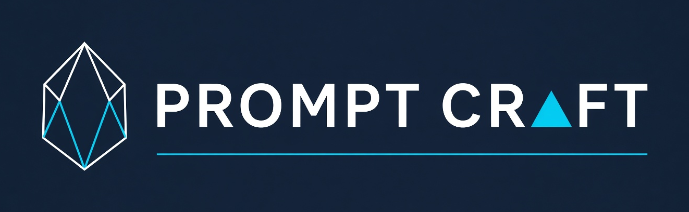

<p align="center">
  <a href="README.ja.md">日本語</a> | <a href="README.zh.md">中文</a> | <a href="README.md">English</a> | <a href="README.fr.md">Français</a> | <a href="README.hi.md">हिन्दी</a> | <a href="README.it.md">Italiano</a> | <a href="README.pt-BR.md">Português (BR)</a>
</p>

<p align="center">
  
</p>

<p align="center">
  <a href="https://github.com/mcp-tool-shop-org/prompt-craft/actions/workflows/ci.yml"></a>
  <a href="LICENSE"></a>
  
</p>

#

**Indica qué debe contener la imagen. Verifica que lo contenga. Rechaza si no es así.**

Un flujo de trabajo generativo de imágenes te proporcionará con gusto un personaje con la cara equivocada, la paleta de colores incorrecta y ninguno de los distintivos de la facción, e informará que fue un éxito, porque nada parecía estar mal. prompt-craft reemplaza la prosa opaca de la instrucción con un **contrato tipificado de afirmaciones representables**, utiliza esa misma lista dos veces: una para escribir la instrucción y otra para verificar los píxeles, y **bloquea el activo cuando una afirmación requerida no está presente**.

```
   CONTRACT  ──atoms──▶  SYNTHESIZE  ──prompt──▶  GENERATE
   typed, depictable     every token traces      diffusion + control
        │                to an atom                     │
        │ the same atoms                                │ pixels
        └──────────────────────▶  GATE  ◀───────────────┘
                    a DIFFERENT model family checks the
                    contract against the image, cheapest
                    tier deciding first
                         │                    │
                       PASS                FAIL / UNCERTAIN
                         ▼                    ▼
                    BIND to canon      REPAIR ladder, or a
                  (only when every     human checkpoint when
                   required atom       the gate is unsure
                   actually passed)
```

**La idea principal:** la lista atómica del contrato es *la misma lista que se utiliza dos veces*. Escribir la instrucción y verificar el resultado a partir de una única fuente garantiza que lo que se solicitó sea lo que se verifica. Esto es lo que cierra el ciclo que una instrucción opaca deja abierto.

## Instalar

```bash
pip install prompt-crafter
pcraft --help
```

```bash
npm install -g @mcptoolshop/prompt-crafter   # the same command, as a launcher
```

La distribución es **`prompt-crafter`** porque `pcraft` y `prompt-craft` ya están disponibles en PyPI; el paquete de importación y el comando siguen siendo `pcraft`. El paquete npm es un **lanzador, no un puerto**: reimplementar un umbral en un segundo lenguaje es la forma en que un umbral se desvía, por lo que redirige a Python, que contiene la verdad e hereda su código de salida.

Para el desarrollo:

```bash
pip install -e ".[dev]"
```

El núcleo es **independiente de la GPU y funciona en cualquier lugar**: toda la suite de pruebas se ejecuta contra un generador y verificador simulados, lo que demuestra que el límite del complemento realmente se mantiene. El paquete adicional `[image]` (torch/diffusers) y el paquete adicional `[synth]` (DSPy + un modelo de lenguaje alojado) conectan el generador, los verificadores y el sintetizador reales. **Ninguno es necesario para ejecutar, probar o evaluar el núcleo.**

```bash
pcraft demo              # the whole loop end-to-end, no GPU, deterministic stubs
pcraft list              # contract ids in the store
pcraft validate          # resolve + compile the question DAG, no generate
pcraft gate <image>      # check an image against a contract
pcraft recipe            # emit the Cloud Kontext + fist-only Fill graph
pcraft replay <record>   # re-read a bound asset's provenance receipt
```

## Cómo se ve un contrato

No es una instrucción en prosa. Es una lista de **afirmaciones atómicas, representables e individualmente verificables**:

- **`must_have`** — una prenda de vestir, una paleta de colores, una silueta, un emblema. Cada uno lleva consigo un `check_type` (que el nivel de puerta verifica), un `severity` y, opcionalmente, un borde `depends_on` para que una afirmación solo tenga sentido cuando su elemento principal haya superado la prueba. No tiene sentido verificar el color de un hacha que no está presente.
- **`must_not`** — restricciones negativas, verificadas como **ausencia en los píxeles**. No es una instrucción negativa: las instrucciones negativas dejan características residuales y terminan siendo paráfrasis.
- **`identity_ref`** — una imagen de referencia. **La identidad es un condicionamiento, no tokens.** El texto anatómico hace que un modelo de difusión renderice un espécimen; una imagen de referencia vincula la cara específica.

Los contratos se heredan: un personaje extiende una facción, y la herencia es **de fallo cerrado**: un elemento secundario puede *elevar* un requisito, pero nunca relajarlo ni eliminarlo silenciosamente.

## La puerta

Tres niveles, el más económico decide primero, escalando solo cuando una respuesta económica no es clara. Un paso ordenado por dependencias significa que un elemento principal fallido marca a sus elementos secundarios como N/A en lugar de puntuar tonterías.

**El verificador siempre es un modelo de una familia diferente al generador**, lo cual se aplica mediante una protección que se niega a ejecutarse de otra manera. Un modelo es un juez deficiente de su propia salida, y ese es el aspecto menos especulativo de este diseño.

**Los códigos de salida distinguen cuatro cosas diferentes**, porque un llamador que lee un solo número debe poder diferenciarlas:

| salida | significado |
|---|---|
| `0` | la puerta se ejecutó y cada átomo requerido superó la prueba |
| `1` | argumentos incorrectos o un contrato mal formado |
| `2` | se ejecutó, y un átomo requerido **falló** |
| `3` | se ejecutó, y el resultado es **no confirmado**: la banda humana |
| `4` | **no se pudo ejecutar**: no hay entrada legible o no hay ningún nivel requerido disponible |

Esa última fila es la que importa. "No pude verificar" y "Verifiqué y está mal" son hechos diferentes, y combinarlos es una fuente documentada de daño real: por eso los navegadores fallan suavemente la revocación de certificados, y por eso los estándares de monitoreo han tenido un veredicto *desconocido* distinto desde la década de 1990. Cada transcripción de puerta también informa **cuántos niveles requeridos se ejecutaron realmente**, independientemente del veredicto, por lo que una puerta que dejó de verificar silenciosamente no puede interpretarse como una aprobación.

**CLIPScore no se utiliza como métrica de la puerta.** Se comporta como un conjunto de conceptos: ignora qué atributo pertenece a qué objeto, las cantidades y las relaciones. Está documentado como conocido por ser defectuoso en la interfaz del verificador para que nadie lo reintroduzca.

## Estado honesto

**v0.2.1: el núcleo es real. El condicionamiento de SDXL se ha implementado en el código. Ahora se ha ejecutado una versión local con una 5090 `generate()`. Se ha probado una receta en la nube.**

| | |
|---|---|
| Núcleo | **328 tests passing** (counted 2026-08-18), GPU-free, deterministic. `verify` runs the suite, the suite again under `-O`, and a package build |
| Predicados | los once puntos de decisión compuestos en `core/` se **prueban mediante mutación**: se eliminaron 20 de 21 mutantes, y [el superviviente tiene nombre](scripts/mutate_predicates.py) en lugar de estar oculto. |
| Condicionamiento SDXL | ControlNet OpenPose, IP-Adapter, LoRA, **InstantID** y el retoque regional están **implementados y cubiertos por pruebas de fake-torch**. InstantID e IP-Adapter no pueden compartir una misma generación. La versión local `generate()` se **ejecutó** en la 5090 (18-08-2026, semilla `169405236028824`, tipo `controlnet_ip`). El fotograma es de estilo orco; el agarre, el sigilo y el brazalete no se aplicaron correctamente. Dos placas de IP-Adapter en un solo adaptador fallan antes de que se procesen los píxeles. |
| Codificador Flux | El modo solo texto y el **relleno** están conectados (fake-torch). ControlNet pose e IP-Adapter siguen rechazados (familia incorrecta). `method=reference` escribe el gráfico de la receta en la nube y se niega a simular que Kontext se ejecuta localmente (`GATE_CLOUD_SUBMIT`). |
| Receta en la nube | `pcraft recipe` emite el ensamblaje de Kontext + recorte izquierdo en el gráfico + relleno Flux solo con puño. `method=reference` es esa ruta. Una ejecución en vivo en la nube (trabajo `06668d4c`, 2026-08-18) produjo un recorte de un solo panel y conservó el soporte. |
| Puerta | El nivel 2 es una expansión DSG real (entidad / atributo / relación). La escalada es un punto de control contrastivo. Los registros almacenan la historia del intento, no solo el recuento de reintentos. |
| Síntesis fuera de línea | `compile_synthesizer` se fija a una métrica de puerta **externa** (`dspy.GEPA` cuando `[synth]` está instalado). Se realizó una compilación en vivo el 18-08-2026 en Ollama local `hermes3:8b` (no se cargó 600B). Fijo `sprite.synth.v1-gepa.json` (`generated_by=gepa`). La semilla `sprite.synth.v1.json` no se ha modificado. El bucle por activo sigue utilizando `TemplateSynthesizer`. La CLI todavía no puede inventar una métrica de píxeles. |
| Subpuerta de identidad | Las puntuaciones de CLIP-I **no están conectadas** a `orchestrate`. Los umbrales 0,55 / 0,05 no tienen ningún valor de retención. Marcadores de posición. |
| Canon real | el contrato de ejemplo enviado es una **invención genérica**, no el canon de ningún proyecto real. Vincular un canon real es una decisión humana deliberada. |

Tres afirmaciones que las versiones anteriores de este documento hicieron y que la medición no respaldó, corregidas aquí en lugar de eliminadas silenciosamente:

- Se describieron los tres umbrales de zona como *calibrados con un conjunto de datos de prueba etiquetado por humanos*. No lo están. Son valores predeterminados.
- La regla de que un modelo generativo nunca puede ser su propia puerta se enunció como si un estudio la hubiera establecido. La evidencia de respaldo es **más convergente que directa**: las encuestas discriminativas de sí/no son mediblemente más estables que el etiquetado abierto, los modelos no pueden corregirse de forma fiable sin retroalimentación externa y el reconocimiento propio rastrea el sesgo de preferencia propia. Ningún estudio único realiza la comparación directa. La regla es sólida; se exageró la certeza.
- Se describió el condicionamiento como no leído y luego como no implementado. Ahora, SDXL **lee** las referencias ensambladas en el código. Una ejecución local `generate()` en esta máquina **ya se ha ejecutado**. Que esté cableado y aplicado no es lo mismo que el plate aparezca en los píxeles.

## Requisitos

| | |
|---|---|
| Python | **3.11+** (la integración continua utiliza la versión 3.13) |
| Plataformas | Python puro, sin extensiones compiladas en el núcleo; desarrollado en Windows 11, la integración continua se realiza en `ubuntu-latest`. |
| Dependencias | el núcleo solo necesita `pydantic`. El trabajo con GPU se encuentra detrás de complementos opcionales. |

## Modelo de confianza y amenazas

- **Datos accedidos**: el archivo JSON del contrato al que se apunta, las imágenes que se le pasan y los registros de procedencia escritos en el directorio especificado. No se lee nada más.
- **Datos NO accedidos**: no se lee, almacena ni transmite ninguna credencial. **No hay telemetría, análisis o recuento de uso**: no hay opción para desactivarlo porque no hay nada que desactivar. El núcleo no importa ninguna biblioteca de red.
- **Comunicación de red**: ninguna desde el núcleo. Los complementos opcionales `[image]` y `[synth]` acceden a un host de modelo por su propia naturaleza; ese es el único camino de la red, e instalarlo es una elección.
- **Permisos**: permisos de usuario normales. Sin elevación de privilegios, sin instalación de servicios, sin escritura en el registro o en la configuración del sistema.
- **El punto crítico, que se revela en lugar de ocultar**: **las operaciones con archivos no están aisladas**. `--records-dir` y `--db` escriben dondequiera que se les indique, deliberadamente, porque esta es una herramienta diseñada para funcionar principalmente a nivel local. Indícales un lugar donde tengas la intención de que escriban.
- **Errores**: los rechazos deliberados llevan un código, un mensaje y una pista, y **generan una excepción en lugar de `assert`**, por lo que `-O` no puede eliminarlos; el conjunto se ejecuta una segunda vez bajo `-O` para demostrarlo. Los fallos inesperados imprimen un rastreo solo bajo `--debug`.

## Estado del soporte

`main` es el único estado compatible. No hay canal de lanzamiento, no hay política de compatibilidad con versiones anteriores, no hay SLA. Se trata de una infraestructura de estudio publicada en código abierto, y no de un producto con un contrato de soporte.

## Cómo se organizan las partes

`core/` es independiente del dominio e importa cero símbolos de difusión o de torch; un complemento de dominio exporta exactamente tres cosas: un generador, una lista de verificadores y un conjunto de reglas de codificador. Agregar un nuevo dominio implica crear un nuevo elemento secundario bajo `domains/`; nada en `core/` cambia. El conjunto sin GPU es lo que mantiene esa afirmación veraz.

```
src/pcraft/
  core/          contract · loop · gate · synth · optimize · receipt   (GPU-free)
  cli/           pcraft: synth | gate | bind | list | validate | demo | replay | doctor | schema | recipe | compile | sync-rules
  domains/       ── PLUGIN BOUNDARY ──
    image/       generators, the three verifier tiers, encoder rules, sprite subdomain
```

Las reglas del codificador bajo `domains/image/rules/` se **generan** a partir de una base de datos de recetas verificadas, no están escritas manualmente y llevan un encabezado de generación. Cada activo vinculado escribe un **recibo de procedencia reproducible** que registra el hash del contrato, el artefacto del sintetizador, el generador y la semilla, la versión del verificador y la transcripción completa por átomo del filtro.

La justificación del diseño, los estándares con los que este repositorio se evalúa a sí mismo y la solución para cada acción irreversible se encuentran en [`STANDARDS.md`](STANDARDS.md) y [`COMPENSATORS.md`](COMPENSATORS.md).

## Colaboradores

Consulte [CONTRIBUTORS.md](CONTRIBUTORS.md). Autor: mcp-tool-shop. Pruebas internas en este repositorio: Grok (xAI).

## Licencia

MIT: consulte [LICENSE](LICENSE). La licencia de cualquier *modelo* utilizado a través de esta herramienta es una cuestión separada y no está cubierta por ella.
